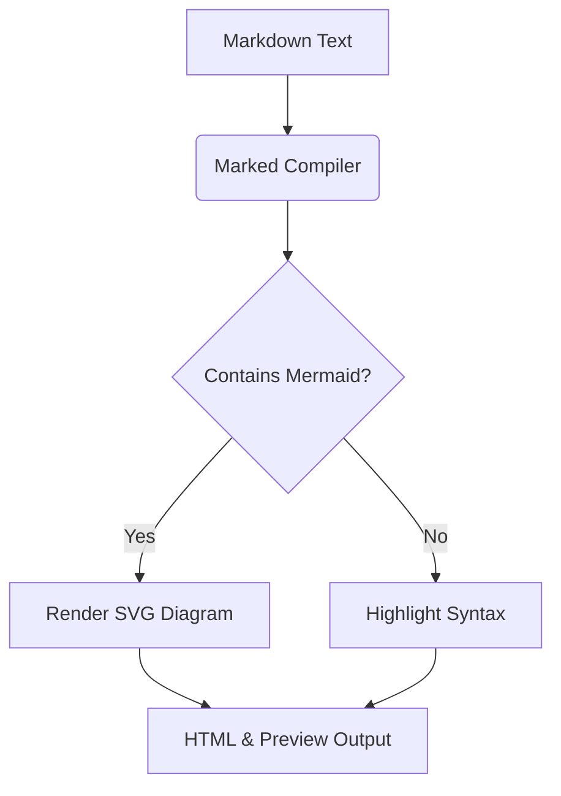

# Markdown to HTML Converter 🚀

Welcome to the premium **Markdown to HTML Converter**! This tool offers an instant split-screen workspace to draft document layouts, compile perfect HTML markup, and inject custom CSS designs in real-time.

## Key Features

1. **Dual Output Tabs**: Toggle instantly between **Preview** (rendered layout) and **Code** (raw compiled HTML code in a read-only code editor).
2. **Dynamic Live Styling**: Click the **Styles** button in the header to open a customization panel. Write custom CSS or select a theme preset to style your HTML instantly.
3. **Responsive Architecture**: Fully adapted workspace layout offering lightning-fast response times.

---

### Code Highlighting Demo

Here is a quick TypeScript snippet demonstrating highlight.js rendering:

```typescript
export class CodeCraftsmanship {
  readonly isAwesome = true;
  constructor(private name: string) {
    console.log(`Crafting high-quality software with ${name}`);
  }
}
```

### Mermaid Diagram Demo

Here is a quick Mermaid flowchart diagram rendered live:



> Crafting elegant tools requires understanding the fundamentals, avoiding shortcuts, and caring about details. Let's make something beautiful!
